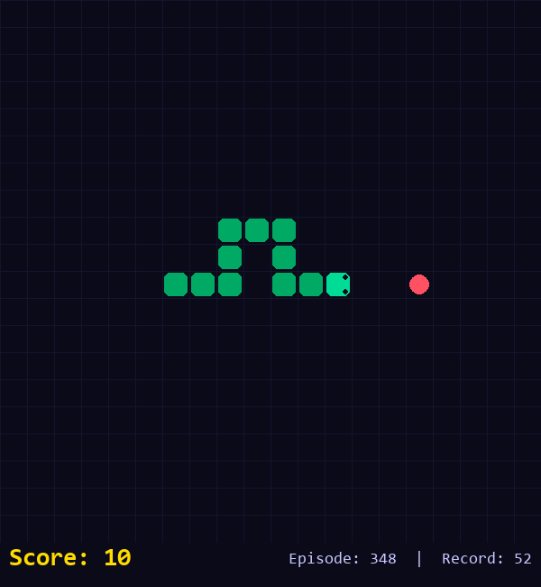
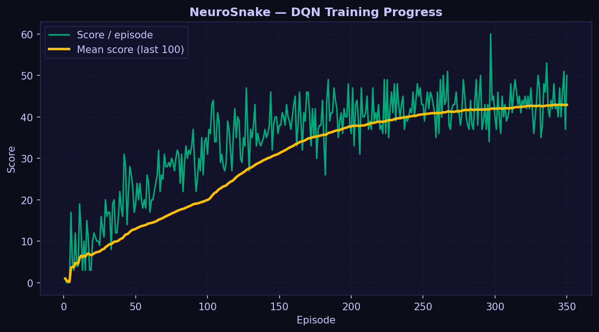

<div align="center">

```
███╗   ██╗███████╗██╗   ██╗██████╗  ██████╗ ███████╗███╗   ██╗ █████╗ ██╗  ██╗███████╗
████╗  ██║██╔════╝██║   ██║██╔══██╗██╔═══██╗██╔════╝████╗  ██║██╔══██╗██║ ██╔╝██╔════╝
██╔██╗ ██║█████╗  ██║   ██║██████╔╝██║   ██║███████╗██╔██╗ ██║███████║█████╔╝ █████╗  
██║╚██╗██║██╔══╝  ██║   ██║██╔══██╗██║   ██║╚════██║██║╚██╗██║██╔══██║██╔═██╗ ██╔══╝  
██║ ╚████║███████╗╚██████╔╝██║  ██║╚██████╔╝███████║██║ ╚████║██║  ██║██║  ██╗███████╗
╚═╝  ╚═══╝╚══════╝ ╚═════╝ ╚═╝  ╚═╝ ╚═════╝ ╚══════╝╚═╝  ╚═══╝╚═╝  ╚═╝╚═╝  ╚═╝╚══════╝
```

**An autonomous Snake agent that learns to play from scratch using Deep Q-Network (DQN) reinforcement learning**

[](https://python.org)
[](https://pytorch.org)
[](https://pygame.org)
[](https://matplotlib.org)
[](LICENSE)

</div>

---

## 🧠 Overview



**NeuroSnake** teaches a neural network to play Snake from absolute zero — no hardcoded rules, no lookahead algorithms. The agent observes an 11-feature state vector, picks actions using a Deep Q-Network, and learns purely through trial and error guided by a sparse reward signal.

Training leverages two core DRL stabilisation techniques:
- **Experience Replay** — random mini-batches break temporal correlations in training data
- **Target Network** — a periodically-frozen copy of the Q-network prevents oscillating Q-value updates

After ~300–600 episodes the agent reliably collects food and avoids walls. After 1 000 episodes it develops efficient routing strategies entirely on its own.

### 🎯 Project Objectives

| # | Objective |
|---|-----------|
| 1 | Implement a complete, production-quality DQN from scratch using PyTorch |
| 2 | Build a Pygame Snake environment with a clean `reset / step / get_state` API |
| 3 | Demonstrate that compact hand-crafted state features outperform raw pixels for this task |
| 4 | Provide three distinct modes — **train**, **human play**, and **AI eval** — via a unified CLI |
| 5 | Visualise the learning curve live during training and export it as a PNG artifact |

---

## 🏗️ Architecture

### Project Structure

```
NeuroSnake/
├── game/
│   └── environment.py      # Pygame Snake environment (SnakeGameAI + HumanGame)
├── ai/
│   ├── model.py            # DQN neural network  (PyTorch nn.Module)
│   ├── agent.py            # Agent: ε-greedy policy, replay, target net
│   └── replay_buffer.py    # Circular deque-based experience replay buffer
├── training/
│   └── train.py            # Trainer class — full episode loop
├── utils/
│   └── plot.py             # LivePlot — non-blocking Matplotlib learning curve
├── models/
│   └── dqn_snake.pth       # Saved model weights (auto-created on record score)
├── main.py                 # CLI entry point  (train | human | eval)
└── config.py               # All hyperparameters in one place
```

### Neural Network (DQN)

```
                  ┌───────────────────┐
  State (11)  ──► │  Linear  11 → 128 │ ──► ReLU
                  └─────────┬─────────┘
                            │
                  ┌─────────▼─────────┐
                  │  Linear 128 → 256 │ ──► ReLU
                  └─────────┬─────────┘
                            │
                  ┌─────────▼─────────┐
                  │  Linear  256 → 3  │
                  └─────────┬─────────┘
                            │
             ┌──────────────┼──────────────┐
             ▼              ▼              ▼
         Q(straight)    Q(right)       Q(left)
```

The agent picks the action with the highest Q-value during exploitation, or a random action during exploration (ε-greedy).

### Key Design Decisions

| Decision | Choice | Rationale |
|----------|--------|-----------|
| State representation | 11 binary features | Fast, efficient — no CNN overhead |
| Action space | 3 (straight / right / left) | Relative directions eliminate illegal 180° reversals |
| NN architecture | 11 → 128 → 256 → 3 | Sufficient capacity; no overfitting on compact state |
| Exploration | ε-greedy (exponential decay) | Standard, proven for tabular-to-DQN transfer |
| Stability | Target network (frozen copy) | Breaks the moving-target problem in Q-learning |
| Optimizer | Adam (lr = 0.001) | Adaptive learning rate — robust across hyperparameter ranges |
| Discount factor | γ = 0.99 | High future-reward weight encourages survival |

---

## 📡 State Representation (11 Features)

The agent never sees raw pixels. Instead, each game frame is encoded as **11 binary floats** — a compact but complete description of the snake's immediate situation.

```
State vector  =  [ danger×3 | direction×4 | food×4 ]
```

| Index | Category | Feature | Value |
|-------|----------|---------|-------|
| `0` | ⚠️ Danger | **Straight** — collision one step ahead in current direction | 0 / 1 |
| `1` | ⚠️ Danger | **Right** — collision one step to the right (clock-wise) | 0 / 1 |
| `2` | ⚠️ Danger | **Left** — collision one step to the left (counter-CW) | 0 / 1 |
| `3` | 🧭 Direction | Moving **RIGHT** | 0 / 1 |
| `4` | 🧭 Direction | Moving **DOWN** | 0 / 1 |
| `5` | 🧭 Direction | Moving **LEFT** | 0 / 1 |
| `6` | 🧭 Direction | Moving **UP** | 0 / 1 |
| `7` | 🍎 Food | Food is to the **LEFT** of head | 0 / 1 |
| `8` | 🍎 Food | Food is to the **RIGHT** of head | 0 / 1 |
| `9` | 🍎 Food | Food is **ABOVE** head | 0 / 1 |
| `10` | 🍎 Food | Food is **BELOW** head | 0 / 1 |

> All features are `float32`. The direction block is one-hot (exactly one of indices 3–6 is `1`). The danger and food blocks can be multi-hot.

**Why only 11 features?**  
A CNN reading raw pixels needs millions of parameters and hours of GPU training. An 11-feature hand-crafted state lets a tiny 3-layer MLP learn effective play in under 20 minutes on CPU — no GPU required.

---

## 🏆 Reward System

The reward signal is deliberately sparse and simple — the agent must figure out everything else through Q-learning.

| Event | Reward | Rationale |
|-------|--------|-----------|
| 🍎 Food collected | **+10.0** | Strong positive signal — the primary objective |
| 💀 Wall or self collision | **−10.0** | Strong negative signal — death is catastrophic |
| ⏱️ Each step taken | **−0.1** | Small penalty discourages aimless wandering and infinite loops |
| ⏰ Timeout (> max steps) | **−10.0** | Treated as death — prevents the snake from spinning forever |

> **Max steps per episode** = `GRID_SIZE × GRID_SIZE × 2` = 800 steps on the default 20×20 grid.

### How the Agent Learns

```
Episode starts
    │
    ▼
Agent sees state s  ─► picks action a (ε-greedy)
    │
    ▼
Environment returns reward r, next state s', done flag
    │
    ▼
Experience (s, a, r, s', done) → pushed to Replay Buffer
    │
    ▼
Random batch sampled → compute TD target:
    target = r + γ · max Q_target(s') · (1 − done)
    │
    ▼
Minimise MSE loss: L = (Q_online(s,a) − target)²
    │
    ▼
Every 10 episodes: copy Q_online weights → Q_target
```

---

## ⚙️ Installation

### Prerequisites

| Dependency | Version | Purpose |
|-----------|---------|---------|
| Python | 3.10+ | Core language |
| PyTorch | 2.x | Neural network & autograd |
| Pygame | 2.x | Game rendering & input |
| NumPy | 1.x+ | State array operations |
| Matplotlib | 3.x | Live training curve |

### Setup

```bash
# 1. Clone the repository
git clone https://github.com/afrit-med-rayan/NeuroSnake.git
cd NeuroSnake

# 2. Create and activate a virtual environment (recommended)
python -m venv venv

# Windows
venv\Scripts\activate

# macOS / Linux
source venv/bin/activate

# 3. Install all dependencies
pip install torch pygame numpy matplotlib
```

> **GPU support (optional):** NeuroSnake trains comfortably on CPU. To use a CUDA GPU, install the matching PyTorch build from [pytorch.org/get-started](https://pytorch.org/get-started/locally/). The agent will automatically detect and use CUDA if available.

### Verify Installation

```bash
python -c "import torch, pygame, numpy, matplotlib; print('All dependencies OK')"
```

---

## 🚀 Usage

The project is driven by a single unified CLI entry point: `main.py`.

### 1. Train the Agent

```bash
python main.py train
```
Watch the AI learn from scratch. A Pygame window displays the agent's actions, while a live Matplotlib chart plots the score and the rolling 100-episode mean.



- The model automatically saves the best run to `models/dqn_snake.pth`.
- Training will run for `NUM_EPISODES` (configurable in `config.py`).

### 2. Play Manually

```bash
python main.py human
```
Play the game yourself using **Arrow Keys** or **W A S D**. Press **R** to restart after game over, or **ESC** to quit.

### 3. Evaluate the Agent

```bash
python main.py eval
```
Loads the saved `models/dqn_snake.pth` weights and watches the agent play. 
- Exploration is completely disabled (`ε = 0`).
- The agent plays greedily using the learned Q-values.

---

## 📊 Expected Results

1. **0–100 episodes**: The agent moves semi-randomly, frequently crashing into walls and exploring the space.
2. **100–300 episodes**: The agent learns to avoid walls. The average score starts to climb.
3. **300–600 episodes**: The agent reliably tracks the food. High scores will exceed 30–40.
4. **600+ episodes**: The agent develops routing strategies to avoid getting trapped by its own tail.


A typical run will result in a `training_curve.png` resembling a logarithmic growth curve, settling around a mean score of 35-50 depending on the `GRID_SIZE` and random seed.

---

## 🔮 Future Improvements

While this DQN agent plays successfully, it does not achieve "perfect play" (filling the entire board). Potential avenues for future iteration:

- **CNN + Frame Stacking:** Replace the 11-feature state with 4 stacked pixel frames and use Convolutional layers.
- **Double DQN (DDQN):** Decouple action selection from action evaluation to reduce overestimation bias in Q-values.
- **Prioritized Experience Replay (PER):** Sample experiences with high TD-error more frequently to speed up learning.
- **Dueling DQN:** Separate the estimation of state value `V(s)` and action advantage `A(s, a)` to stabilize learning when actions don't highly influence the state value.
